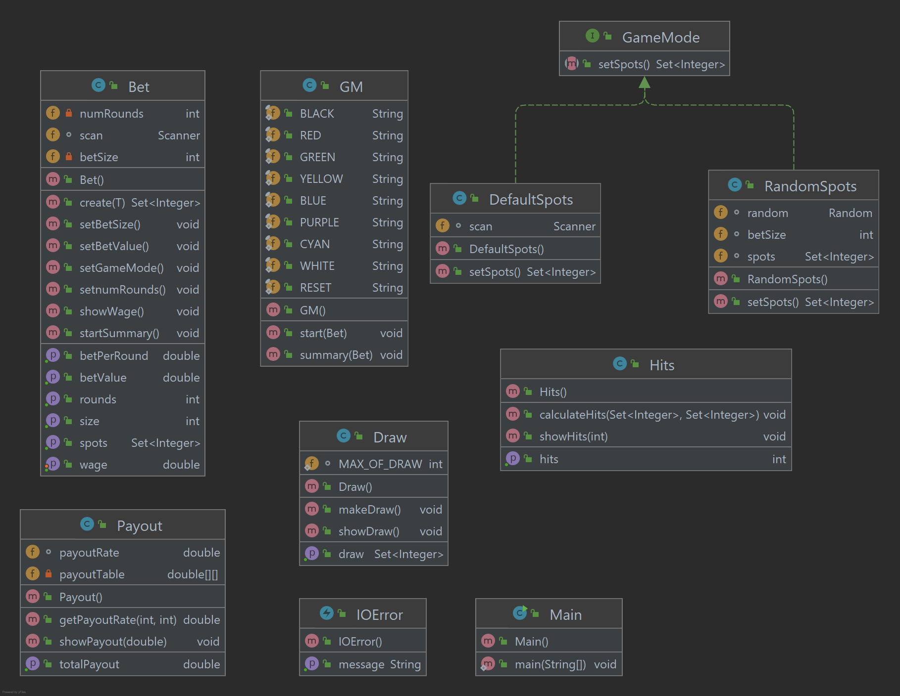

# Keno

## Project purpose
This project implements the Keno game.

Keno is a lottery-like gambling game often played at modern casinos, and also offered as a game by some state lotteries. 

More information is available [at this link](https://en.wikipedia.org/wiki/Keno).

## Project organization with the respective class diagram

## Build and run instructions
To build and run the program, just access the `Main.java` file, in the path `Keno/src/main/java/Keno`, and click on the green Run button that says `Run 'Main.main()'`.

## Authors
- Paulo Vitor Fernandes Andrade
- Rita de Cássia Chagas da Cruz
- Victor Vieira Targino